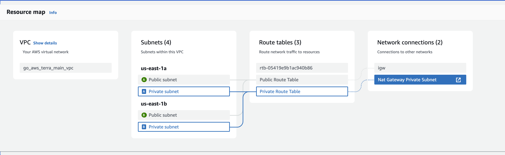

# Go-Aws-Terra

## Introduction to go-aws-terra

Welcome to the API documentation! This API provides endpoints for managing authors.

## Project Structure

The project follows a monorepo microservice structure, with the following directories and files:


- **Authors Service**: Handles operations related to managing authors.
- **Send Telegram Message Service**: Handles operations related to sending messages via Telegram.

### Infrastructure

The project's infrastructure is managed using Terraform. Terraform files are used to define, provision, and manage the AWS resources required for the project.

To apply this configuration:

1. Make sure Terraform is installed on your system.
2. Navigate to the directory containing the Terraform files.
3. Run `terraform init` to initialize the working directory.
4. Run `terraform plan` to preview the changes that will be applied.
5. If everything looks good, run `terraform apply` to apply the change
### CI/CD Process

The development process of the project is automated using a CI/CD tool CircleCI. Here's how the CI/CD process works:

1. **Commit and Push**: When a developer makes changes to a microservice, they commit their changes and push them to GitHub.

2. **Triggering the CI Process**: Upon the push, CircleCI is automatically triggered to start the CI process. This initiates the defined workflows specified in the CircleCI configuration file.

3. **Path Filtering**: CircleCI identifies the microservice that changes have been made to and focuses only on that service. This reduces unnecessary processing time and resource consumption.

4. **Development and Master Branch Control**: The CI process checks whether the changes for the development or master branch.

5. **Building Docker Images**: Docker images can be built. These images can be created separately for each microservice and pushed to a container image repository AWS ECR.

6. **Deployment**: After successful buildng, CD process can trigger deployment using ArgoCD. ArgoCD is responsible for deploying the Docker images to the target environment EKS This step ensures that the new code changes are deployed into production.

This process accelerates development, reduces the likelihood of errors, and enhances code quality. Path filtering ensures that only changes relevant to a specific microservice are processed, making the process more efficient.


### Technologies Used

The project is built using the following technologies:

- **Go**: The primary programming language for developing the microservices.
- **PostgreSQL**: Used for Database.
- **AWS**: Amazon Web Services is used for cloud hosting, including services like Amazon Elastic Kubernetes Service (EKS), Amazon RDS for databases and others.
- **Docker**: Used for containerizing the microservices.
- **Kubernetes**: Used for container orchestration and deployment.
- **Terraform**: Used for infrastructure provisioning and management.
- **CircleCI**: Used for continuous integration (CI) pipelines.
- **ArgoCD**: Used for continuous integration (CD) pipelines.
## Authors API Documentation

This document provides detailed documentation for the endpoints provided by the Authors API.

### Endpoints

### Create Author

- **Endpoint:** `/create-author`
- **Method:** POST
- **Description:** Creates a new author.
- **Example Request:**
  ```http
  POST /create-author HTTP/1.1
  Host: api.example.com
  Content-Type: application/json
  {
    "name": "John Doe",
    "email": "john@example.com"
  }

  // Example response
  {
    "message": "Author created successfully"
  }
  ```
  ### Retrieve All Authors

- **Endpoint:** `/get-authors`
- **Method:** GET
- **Description:** Retreive all authors
- **Example Request:**
  ```http
  GET /get-authors HTTP/1.1
  Host: api.example.com
  Content-Type: application/json

  // Example response
  {
    "message": [
      {
        "ID": 1,
        "CreatedAt": "2024-05-11T23:27:20.719945Z",
        "UpdatedAt": "2024-05-11T23:27:20.719945Z",
        "DeletedAt": null,
        "name": "John Doe",
        "email": "john@example.com"
      },
      {
        "ID": 2,
        "CreatedAt": "2024-05-11T23:29:15.612265Z",
        "UpdatedAt": "2024-05-11T23:29:15.612265Z",
        "DeletedAt": null,
        "name": "Foo",
        "email": "Bar@example.com"
      }
    ]
  }
  ```
    ### Retrieve One Author

- **Endpoint:** `/get-author/{id}`
- **Method:** GET
- **Description:** Retreive all authors
- **Example Request:**
  ```http
  GET /get-author/1 HTTP/1.1
  Host: api.example.com
  Content-Type: application/json

  // Example response
  {
	"message": {
      "ID": 1,
      "CreatedAt": "2024-05-11T23:27:20.719945Z",
      "UpdatedAt": "2024-05-11T23:27:20.719945Z",
      "DeletedAt": null,
      "name": "John Doe",
      "email": "john@example.com"
	  }
  }
  
  ```

  ### Send created authors to someone via telegram

- **Endpoint:** `/authors/send-to/{chatId}`
- **Method:** GET
- **Description:** Retreive all authors
- **Example Request:**
  ```http
  GET /authors/send-to/-405045 HTTP/1.1
  Host: api.example.com
  Content-Type: application/json

  // Example response

  {
    "message": "Authors sent successfully"
  }```


### VPC Structure


The project utilizes AWS Virtual Private Cloud (VPC) for networking and security isolation. VPC allows you to create a virtual network within AWS and control various networking aspects such as IP address range, subnets, route tables, and security groups.

#### Subnets

Subnets are divisions within the VPC that allow you to segment resources. There are two types of subnets within this VPC:

- **Public Subnets**:
  - Located in us-east-1a and us-east-1b availability zones.
  - Connected to the Public Route Table.
  - Attached to the Internet Gateway (IGW) for internet access.

- **Private Subnets**:
  - Also located in us-east-1a and us-east-1b availability zones.
  - Connected to the Private Route Table.
  - Routed to the NAT Gateway for internet access while remaining private.

#### Route Tables

Route tables define how network traffic is routed within the VPC. In this VPC, there are two route tables:

- **Public Route Table ()**:
  - Associated with the Public Subnets.
  - Routes traffic destined for the internet to the Internet Gateway (IGW).

- **Private Route Table**:
  - Associated with the Private Subnets.
  - Routes traffic destined for the internet to the NAT Gateway, allowing private resources to access the internet.

#### Network Connections

The VPC has two main network connections:

- **Internet Gateway (IGW)**:
  - Provides internet access for resources within the Public Subnets.
  - Allows inbound and outbound traffic to and from the internet.

- **NAT Gateway**:
  - Allows resources within the Private Subnets to access the internet while maintaining privacy.
  - Acts as a gateway for outbound traffic initiated by resources in the private subnet.
